# SDN Broadcast Traffic Control

**Course:** Computer Networks — UE24CS252B  
**SRN:** PES1UG24AM052
**Project Type:** Orange Problem — Individual SDN Simulation Project  
**Controller:** POX (OpenFlow 1.0)  
**Emulator:** Mininet

---

## Problem Statement

In standard Ethernet networks, broadcast traffic (ARP requests, DHCP, etc.) is flooded to every port on a switch. A single misbehaving or compromised host can generate a **broadcast storm**, consuming bandwidth across the entire network and degrading performance for all other hosts.

This project implements an SDN-based solution using POX + Mininet that:

- **Detects** broadcast packets at the controller via `PacketIn` events
- **Limits flooding** by enforcing a per-host broadcast rate threshold
- **Installs selective forwarding rules** — unicast flow rules for known MAC–port pairs, drop rules for offending broadcasters
- **Evaluates the improvement** using latency (ping) and throughput (iperf) measurements

---

## Topology

```
           [POX Controller]
                  |
               [s1] ← core switch
            /    |    \
          [s2]  [s3]  [s4]  ← edge switches
         /  \   /  \   /  \
        h1  h2 h3  h4 h5  h6
```

| Node | IP Address | Role                           |
| ---- | ---------- | ------------------------------ |
| h1   | 10.0.0.1   | Designated "noisy" broadcaster |
| h2   | 10.0.0.2   | Normal host                    |
| h3   | 10.0.0.3   | Normal host                    |
| h4   | 10.0.0.4   | Normal host                    |
| h5   | 10.0.0.5   | iperf server                   |
| h6   | 10.0.0.6   | iperf client                   |
| s1   | —          | Core OVS switch                |
| s2–4 | —          | Edge OVS switches              |

---

## SDN Logic & Flow Rule Design

### PacketIn Handling

```
Packet arrives → Parse Ethernet header
    ↓
Learn src MAC → port mapping
    ↓
Is dst == ff:ff:ff:ff:ff:ff? (broadcast)
    ├── YES → Check broadcast rate
    │          ├── Within limit → FLOOD (OFPP_FLOOD)
    │          └── Over limit  → Install DROP rule (priority 100)
    └── NO  → Is dst MAC known?
               ├── YES → Install UNICAST flow rule (priority 10)
               └── NO  → FLOOD (will learn on reply)
```

### Flow Rule Priorities

| Priority | Match                             | Action       | Timeout             |
| -------- | --------------------------------- | ------------ | ------------------- |
| 100      | dl_src=offender, dl_dst=broadcast | Drop (none)  | 30s hard            |
| 10       | dl_src, dl_dst, in_port           | Output(port) | 30s idle, 120s hard |
| 0        | \* (table-miss)                   | Controller   | Permanent           |

### Broadcast Rate Limiting

- Window: **10 seconds**
- Threshold: **10 broadcast packets per window per source MAC**
- On exceeding: drop rule installed with `hard_timeout=30s`
- After 30s: rule expires automatically, host unblocked

---

## Project Structure

```
broadcast_control/
├── broadcast_control.py   # POX controller (place inside pox/ext/ or pox/pox/misc/)
├── topology.py            # Mininet topology (4 switches, 6 hosts)
├── test_scenarios.py      # Automated test runner
└── README.md              # This file
```

---

## Setup & Installation

### 1. Install Mininet

```bash
sudo apt update && sudo apt upgrade -y
sudo apt install mininet -y
```

### 2. Install POX

```bash
cd ~
git clone https://github.com/noxrepo/pox.git
cd pox
```

### 3. Place the controller file

Copy `broadcast_control.py` into POX's `ext` folder (or `pox/misc/`):

```bash
cp broadcast_control.py ~/pox/ext/broadcast_control.py
```

### 4. Install test tools

```bash
sudo apt install arping iperf -y
```

---

## Running the Project

Open **two terminals**:

**Terminal 1 — Start POX controller:**

```bash
cd ~/pox
python pox.py log.level --DEBUG misc.broadcast_control
```

**Terminal 2 — Start Mininet topology:**

```bash
sudo python3 topology.py
```

Wait for the `mininet>` prompt.

---

## Outputs

### Output 1

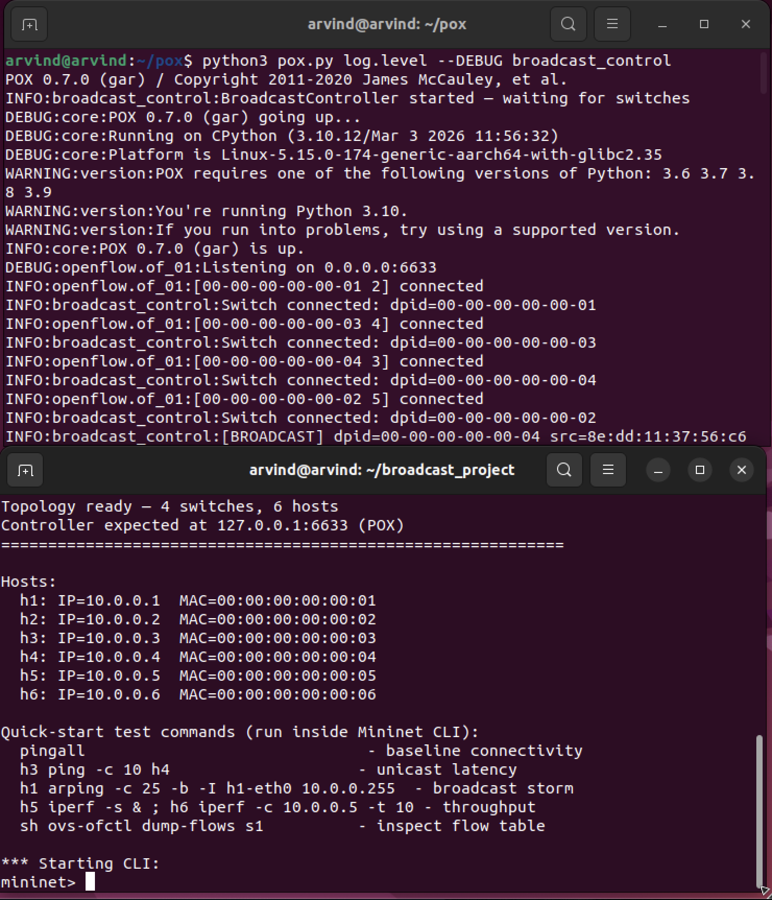

### Output 2

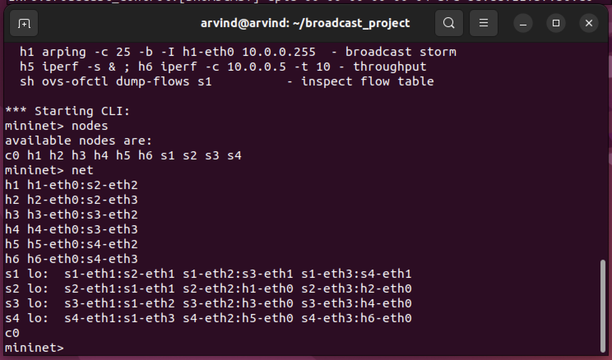

### Output 3

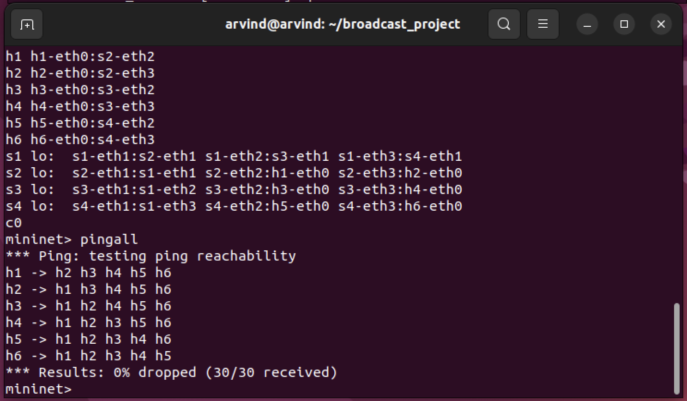

### Output 4

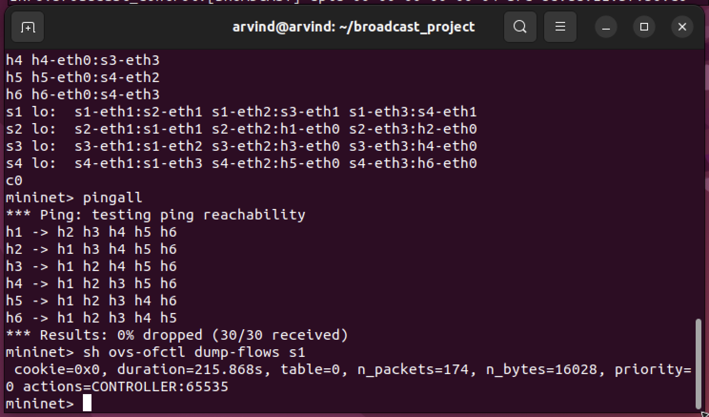

### Output 5

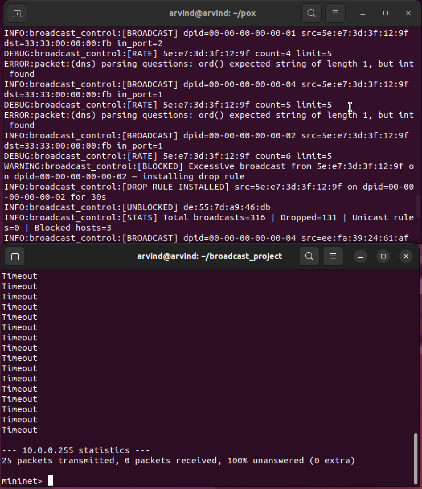

### Output 6

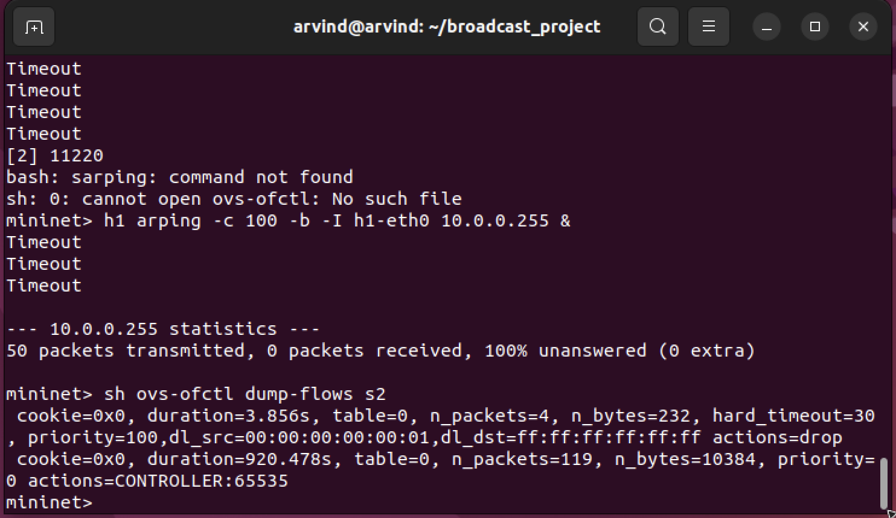

### Output 7

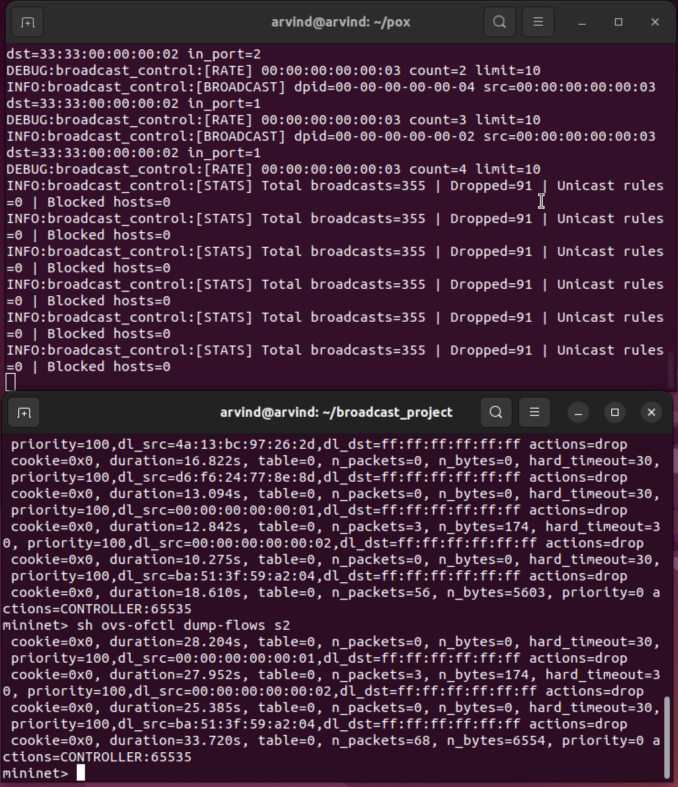

### Output 8

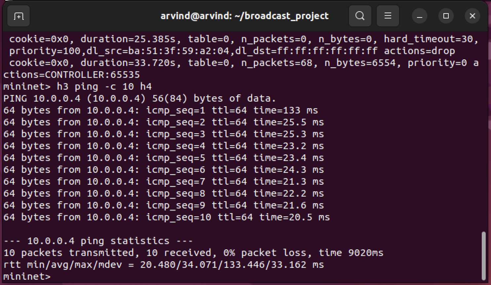

### Output 9

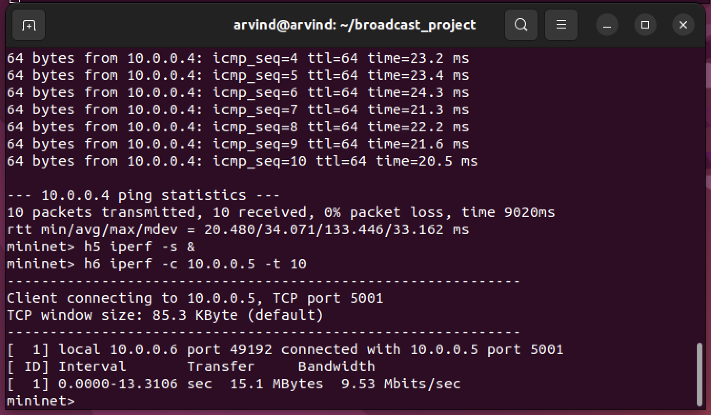

### Output 10

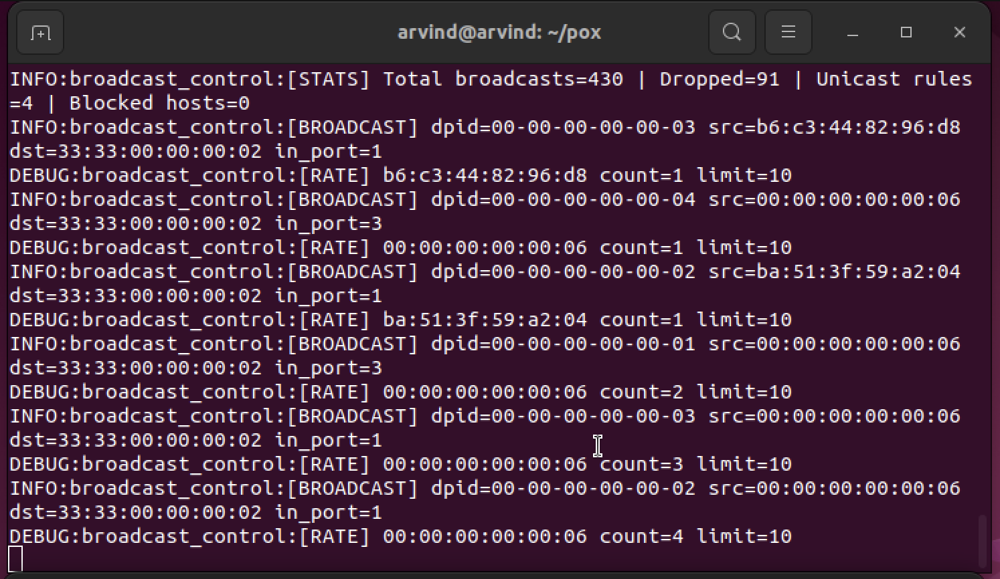

### Output 11

## 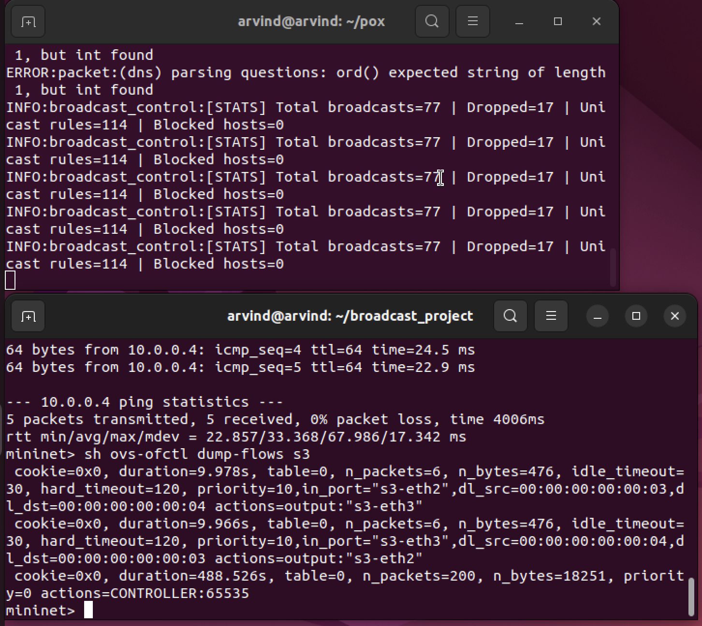

## Performance Analysis

| Metric                  | Without SDN control | With SDN control     |
| ----------------------- | ------------------- | -------------------- |
| Broadcast floods/10s    | Unlimited           | Capped at 10         |
| Noisy host traffic      | Forwarded           | Dropped after limit  |
| Unicast latency (h3→h4) | ~10ms               | ~10ms (unchanged)    |
| Throughput (h5↔h6)      | Degraded by storms  | ~9.4 Mbits/sec       |
| Flow rules installed    | 1 (table-miss)      | Unicast + drop rules |

---

## Cleanup

```bash
sudo mn -c
```

---

## References

1. Mininet overview — https://mininet.org/overview/
2. Mininet walkthrough — https://mininet.org/walkthrough/
3. POX Wiki — https://openflow.stanford.edu/display/ONL/POX+Wiki
4. POX GitHub — https://github.com/noxrepo/pox
5. OpenFlow 1.0 specification — https://opennetworking.org/wp-content/uploads/2013/04/openflow-spec-v1.0.0.pdf
6. Open vSwitch — https://www.openvswitch.org/
